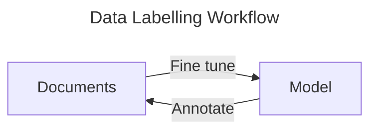

> Check out the footnote for the resources!

# Project Overview

This project aimed to develop a system that utilises deep learning models to efficiently verifying *offline* (handwritten) signatures. The challenged was to accurately compare scanned or captured signatures against known samples, even with variations in style and quality. With this system, the process of verifying valid signatures can be significantly shorter and less tedious. 
# Approach

I've decided to split the system into 4 subsystems, each with its own challenges: [^1][^2][^3]
1. Signature Detection
2. Signature Extraction
3. Feature Extraction
4. Signature Matching

## Signature Detection and Extraction

### Model Selection
The challenge in this phase is to precisely locate the signature area within a given document image. An accurate model is pertinent as the subsequent phases relies on having the correct signature image to analyse. 

My approach to implement this phase is to leverage an **object detection models** specifically fine-tuned for locating handwritten signatures. There are several robust frameworks, including [options](https://github.com/ultralytics) from Ultralytics, [OpenMMLabs](https://github.com/open-mmlab/mmdetection), [YOLOX](https://github.com/Megvii-BaseDetection/YOLOX), and [Wong Kin Yiu's YOLOv9](https://github.com/WongKinYiu/yolov9), but I chose to work with [YOLO NAS](https://github.com/Deci-AI/super-gradients), because of it provides a good balance between speed and accuracy, a key consideration in building a system meant to very PIDs. This also allowed me to leverage the existing knowledge that the model had already gained from training on large datasets, significantly reducing the training time and computational resources while still achieving high accuracy and speed. 

![[yolo_nas_frontier.png]]
*Credits to DECI.AI*

It's also easy to use with tonnes of documentations online to follow, making it a pretty solid choice. 
### Data Preparation 

To train an effective object detection model, I require a substantial dataset of labelled signature images. This data preparation phase was the most tedious part of the project. I had to manually label signature instances across documents. To undertake this task, I had use [**Label Studio**](https://labelstud.io/), a free, open source data labelling platform. With **Label studio**, I can streamline the arduous task and enhance efficiency significantly by leveraging its model-assisted labelling the feature to accelerate the annotation workflow, albeit I had to use my own model.  

![[labelling_signature_cheques.png]]
*My hand broke*

To build the model, I first annotated a batch of 100 images, used those images to fine-tune the YOLO NAS model, and then employed the fine-tuned model to annotate another batch of images. *Rinse and repeat*



While this is a tedious process, this meticulous process was fundamental to provide the model with high-quality data it needed to learn accurate signature localisation.

Once a satisfactory batch of annotated documents are made (*depended on my mood*), I followed it up by processing the exported COCO-formatted data. This involved writing custom Python scripts to parse the JSON annotation files and organise the image data into a structure suitable for model training. 

>[!EXAMPLE]- `result.json`
>```json
>{
>    "images": [
>        {
>            "width": 512,
>            "height": 256,
>            "id": 0,
>            "file_name": "images\\72688b1a-9.jpg"
>        },
>        {
>            "width": 512,
>            "height": 256,
>            "id": 1,
>            "file_name": "images\\c74fcc14-8.jpg"
>        },
>        {
>            "width": 512,
>            "height": 256,
>            "id": 2,
>            "file_name": "images\\84d90c86-725.jpg"
>        },
>        {
>            "width": 512,
>            "height": 256,
>            "id": 3,
>            "file_name": "images\\4f5fc16d-721.jpg"
>        },
>        {
>            "width": 512,
>            "height": 256,
>            "id": 4,
>            "file_name": "images\\dc64b1b1-722.jpg"
>        },
>        {
>            "width": 512,
>            "height": 256,
>            "id": 5,
>            "file_name": "images\\48a0fe01-723.jpg"
>        },
>        {
>            "width": 512,
>            "height": 256,
>            "id": 6,
>            "file_name": "images\\2b838332-724.jpg"
>        },
>        {
>            "width": 512,
>            "height": 256,
>            "id": 7,
>            "file_name": "images\\55275e3f-716.jpg"
>        },
>        {
>            "width": 512,
>            "height": 256,
>            "id": 8,
>            "file_name": "images\\1c959e05-718.jpg"
>        },
>        {
>            "width": 512,
>            "height": 256,
>            "id": 9,
>            "file_name": "images\\6b6f1edb-719.jpg"
>        },
>        {
>            "width": 512,
>            "height": 256,
>            "id": 10,
>            "file_name": "images\\d7caedce-720.jpg"
>        }
>    ],
>    "categories": [
>        {
>            "id": 0,
>            "name": "signature"
>        }
>    ],
>    "annotations": [
>        {
>            "id": 0,
>            "image_id": 0,
>            "category_id": 0,
>            "segmentation": [],
>            "bbox": [393.79036827195466, 144.31728045325778, 82.67422096317284, 67.44475920679888],
>            "ignore": 0,
>            "iscrowd": 0,
>            "area": 5575.942925470877
>        },
>        {
>            "id": 1,
>            "image_id": 1,
>            "category_id": 0,
>            "segmentation": [],
>            "bbox": [380.0113314447592, 142.8668555240793, 93.55240793201133, 65.26912181303118],
>            "ignore": 0,
>            "iscrowd": 0,
>            "area": 6106.083509216832
>        },
>        {
>            "id": 2,
>            "image_id": 2,
>            "category_id": 0,
>            "segmentation": [],
>            "bbox": [385.813031161473, 150.11898016997168, 95.00283286118982, 62.36827195467422],
>            "ignore": 0,
>            "iscrowd": 0,
>            "area": 5925.162516351147
>        },
>        {
>            "id": 3,
>            "image_id": 3,
>            "category_id": 0,
>            "segmentation": [],
>            "bbox": [385.08781869688386, 148.6685552407932, 94.27762039660061, 63.81869688385268],
>            "ignore": 0,
>            "iscrowd": 0,
>            "area": 6016.674879021582
>        },
>        {
>            "id": 4,
>            "image_id": 4,
>            "category_id": 0,
>            "segmentation": [],
>            "bbox": [392.3399433427762, 144.31728045325778, 82.67422096317277, 65.9943342776204],
>            "ignore": 0,
>            "iscrowd": 0,
>            "area": 5456.030174385475
>        },
>        {
>            "id": 5,
>            "image_id": 5,
>            "category_id": 0,
>            "segmentation": [],
>            "bbox": [384.36260623229464, 150.8441926345609, 89.2011331444759, 55.84135977337112],
>            "ignore": 0,
>            "iscrowd": 0,
>            "area": 4981.112568113058
>        },
>        {
>            "id": 6,
>            "image_id": 6,
>            "category_id": 0,
>            "segmentation": [],
>            "bbox": [384.36260623229464, 147.21813031161474, 90.65155807365437, 67.44475920679886],
>            "ignore": 0,
>            "iscrowd": 0,
>            "area": 6113.972505998762
>        },
>        {
>            "id": 7,
>            "image_id": 7,
>            "category_id": 0,
>            "segmentation": [],
>            "bbox": [382.186968838527, 146.4929178470255, 100.0793201133144, 68.16997167138813],
>            "ignore": 0,
>            "iscrowd": 0,
>            "area": 6822.404417016426
>        },
>        {
>            "id": 8,
>            "image_id": 8,
>            "category_id": 0,
>            "segmentation": [],
>            "bbox": [394.5155807365438, 147.94334277620396, 73.24645892351276, 64.54390934844191],
>            "ignore": 0,
>            "iscrowd": 0,
>            "area": 4727.612804853582
>        },
>        {
>            "id": 9,
>            "image_id": 9,
>            "category_id": 0,
>            "segmentation": [],
>            "bbox": [385.813031161473, 150.8441926345609, 89.92634560906518, 54.39093484419267],
>            "ignore": 0,
>            "iscrowd": 0,
>            "area": 4891.178004799016
>        },
>        {
>            "id": 10,
>            "image_id": 10,
>            "category_id": 0,
>            "segmentation": [],
>            "bbox": [390.1643059490085, 146.4929178470255, 83.39943342776205, 65.26912181303116],
>            "ignore": 0,
>            "iscrowd": 0,
>            "area": 5443.407779534385
>        }
>    ]
>}
>```

The final step in data preparation is to prepare the training set, test set, and the validation set; I divided the labelled images into distinct training, validation, and test sets using standard techniques - `train_test_split` from `sklearn`, ensuring a fixed random seed for reproducibility. This splitting is needed to make sure that the model does not get over-tuned and to obtain an evaluation of its performance on unseen data before integrating it into the verification pipeline. 

```python
    train_files, test_files = train_test_split(images, test_size = test_size, random_state=random_state)
    
    train_files, validation_files = train_test_split(train_files, test_size = val_size, random_state=random_state)
    
    return (train_files, validation_files, test_files)
```

### Fine tuning

>[!INFO] Kaggle
>This is done in Kaggle. 

With the labelled dataset prepared and split, the next step was to fine tune the pre-trained YOLO NAS model to locate the signature areas. Using the YOLO NAS framework's training tools, I configured the fine-tuning process; I loaded the pre-trained weights and directed the training pipeline to use my labelled signature dataset. 

I chose `Adam` optimiser with a dynamic learning rate schedule. I configured the dynamic learning schedule, implementing a small warmup phase to stabilise training at the beginning, and a cosine decay schedule. This approach gradually decreases the learning rate over epochs, allowing the model to converge more effectively, with an initial learning rate of $5\times{10}^{-4}$. 

To prevent overfitting to the relatively specialised signature, I incorporated **weight decay** and **Exponential Moving Average** for the model weights. I utilised EMA, a technique known to improve the model's generalisation ability by averaging weights over training steps.  

I set the training to run for a maximum of **75** epochs and monitored the training progress to determine the optimal stopping point. 

For the loss function, I utilised `PPYoloELoss`, the standard loss function for the YOLO NAS architecture, designed to guide the model in learning both object localisation and classification for this type of network. During training, I monitored the model's performance using standard object detection metrics. I focused on **Mean Average Precision** (`mAP`), evaluating it specifically at an Intersection over Union (`IoU`) threshold of 0.5 (`mAP@0.5`) and extended it to a range of thresholds ($0.5$ - $0.95$) (`mAP@0.5:0.95`) to get a comprehensive view of the model's performance.  

Once the parameters had been set, I used the `Trainer` object to load the `yolo_nas_s` model, as detecting signatures is a rather simple task and `yolo_nas_s` was deemed sufficient to provide a balance of accuracy and speed without being overly computationally expensive. I then initiated training, utilising Kaggle's GPU acceleration to speed up computation. 

### Testing the model

After fine-tuning, the YOLO NAS model's performance is evaluated on unseen data. I used a dedicated **test set**, held separate from the training and validation data, to obtain an unbiased measure. I evaluated the fine-tuned model - `best_model` - using the `SuperGradients's` `trainer.test`; I configured the evaluation metrics to calculate Mean Average Precision (`mAP`) at an Intersection over Union (`IoU`) threshold of 0.5, a standard metric for object detection accuracy.

Beyond quantitative metrics, I also validated the model's performance qualitatively by generating predictions on individual images from the test set. This involves feeding an image to the trained model and visualizing the predicted bounding boxes. 

>[!BUG] Unfortunately
>The model works, but I forgot to save an example, and the library is bugged.
> 
>So, I will link the [kaggle notebook](https://www.kaggle.com/code/jimding/yolo-nas-model) 
### Extracting Signatures

With the signature bounding box successfully identified by the fine-tuned YOLO NAS model and a some simple python code, I was able to isolate the signatures from the documents. This extraction process was essential to prepare the data for the subsequent signature verification stage.

However, for training the signature verification model, I had decided to use the CEDAR dataset[^4], because it is a widely used benchmark dataset in signature verification research. It provides a balance of genuine and forged signatures from multiple individuals, making it highly suitable for training and evaluating a verification model.
## Processing Images[^5]

In this stage, my aim is to reduce as much noise as possible and ensure that the crucial features extracted for the verification model are confined to the strokes of the signatures. 

After obtaining the signature images, I notice that the while the images are grayscale and generally clear, variations in stroke intensity and potential residual 
noise could still impact the accuracy of the features extracted to capture the precise shape and structure of each stroke of the signatures. 

I had implemented **Otsu's thresholding**. This technique automatically determines the optimal global threshold to convert the grayscale image into a binary image. 

| Class    | Before                            | After                           |
| -------- | --------------------------------- | ------------------------------- |
| Original | ![[unprocessed_original_1_1.png]] | ![[processed_original_1_1.png]] |

By applying this technique, I was able to effectively isolate the signature strokes from the background, creating a cleaner representation of the signature's strokes. The clear distinction of the foreground from the background is important for the subsequent feature extraction that rely on analysing the shape, contours, and topology of the signature. Now that every stroke has the same intensity in colour, the verification model can focus on the most relevant visual information for distinguishing genuine signatures from forgeries.

>[!NOTE]- The Difference In Image Size
>Most pre-trained models available on `PyTorch` are built to accept $224\times 224$ sizes. 

## Signature Verification

*Buckle up, this section is long!*

Now that I've applied **Otsu's thresholding** to both sets of forgeries and original images, it's time to build the dataset; however, before I went ahead with that, I had to determine how the model would learn and verify signature images - this required the model to learn the subtle visual characteristics that distinguish genuine signatures from different individuals' signatures and forgeries.. 

After thorough research into deep metric learning techniques commonly applied in image recognition tasks such as face recognition, I determined that an **embedding-based** approach would fit perfectly with this problem. I decided that I would train a **convolutional neural network (CNN)** to map each signature image into an embedding in a high-dimensional space; the embeddings of the genuine signatures from the same author would be close to each other, while embeddings signatures from other authors or forgeries should be far apart.  

I chose to develop a  **triplet loss network**, because of the mechanisms in which it works;  there are three data points - anchor (*a genuine signature*), positive (*another genuine signature from the same author*), and negative (*a forged signature or signature from another author*) - used in each instance. The model learns to widen the distance between the negative data point and the anchor, while minimising the distance between the anchor and the positive data point. 

This embedding-based approach directly supports the verification task; if I want to verify a signature, I would compare its embedding to known genuine embeddings; if the distance is below a threshold, it's more likely to be genuine. 


[^1]: [Check Forgeries: Leveraging AI and Machine Learning for Signature Verification](https://orbograph.com/check-forgeries-leveraging-ai-and-machine-learning-for-signature-verification/) 
[^2]: [How AI Works in Signature Verification Tools](https://sqnbankingsystems.com/blog/how-ai-works-in-signature-verification-tools/)
[^3]: [How AI and ML can Revolutionize Banks Signature Verification Process](https://www.forbes.com/councils/forbestechcouncil/2023/08/09/how-ai-and-ml-can-revolutionize-banks-signature-verification-process/)
[^4]:[CEDAR signature](https://paperswithcode.com/dataset/cedar-signature)
[^5]:[Otsu's Method](https://en.wikipedia.org/wiki/Otsu%27s_method)
