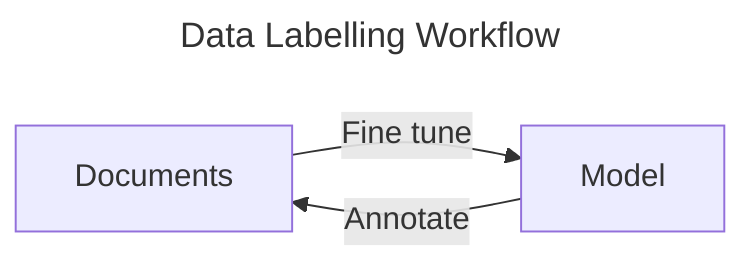

> It's time I update this again! 

>Check it out: [Click me!](https://github.com/HappyPotatoHead/signature-verification-sct-plus)

# Project Overview

This project revolves around the verification of handwritten signatures, specifically using deep learning models to achieve accurate verification. However, since models are not perfect and can sometimes make potentially catastrophic mistakes, this system functions best when complemented by human oversight.
# Approach

I've decided to split the system into 4 subsystems, each with its own challenges: [^1][^2][^3]
1. Signature Detection
2. Signature Extraction
3. Feature Extraction
4. Signature Matching/Verification

## Signature Detection and Extraction

>[!BUG] Unfortunately
>The model worked, but I forgot to save an example (*oops!*), and the library is bugged.
> 
>So, I will link the [YOLO NAS Model - Broken at 25/4/2025 ](https://www.kaggle.com/code/jimding/yolo-nas-model)
### Model Selection

The challenge in this phase is to precisely locate the signature area within a given image. High accuracy is pertinent as the subsequent phases rely on having the correct signature images to analyse. 

I decided to fine-tune existing **object detection models** to locate signatures . There are several robust frameworks, including options from [Ultralytics](https://github.com/ultralytics), [OpenMMLabs](https://github.com/open-mmlab/mmdetection), [YOLOX](https://github.com/Megvii-BaseDetection/YOLOX), and [Wong Kin Yiu's YOLOv9](https://github.com/WongKinYiu/yolov9), but I chose to work with [YOLO NAS](https://github.com/Deci-AI/super-gradients), because it provides a good balance between speed and accuracy, a key consideration in building a system meant to verify Personally Identifiable Information (PII). 

Utilising an existing object detection model also allows me to leverage model's transfer learning capabilities, significantly reducing the training time and computational resources while still achieving high accuracy and speed. 

![[yolo_nas_frontier.png]]
*Credits to DECI.AI*

It is also easy to use with a ton of documentations online to follow, making it a pretty solid choice. 

### Data Preparation 

To fine-tune an effective object detection model, I require a substantial dataset of labelled signature images. This task was the most tedious part of this project; I had to manually label signature instances across multiple documents. 

To undertake this task, I used [**Label Studio**](https://labelstud.io/), a free, open source data labelling platform. Label studio offers a model-assisted labelling feature to accelerate the annotation workflow. However, this feature can only be used, if I provide a model of my own.  So, I still had to label the signature instances manually. 

![[labelling_signature_cheques.png]]
*My hand broke*

To build the model, I first annotated a batch of 100 images, used those images to fine-tune the YOLO NAS model, and then employed the fine-tuned model to annotate another batch of images - *rinse and repeat*



The bounding box must be as tight as possible to ensure that both the object detection model and the feature extraction model learn only from relevant information. 

Once a satisfactory batch of annotated documents was created, I followed up by processing the exported COCO-formatted data. This involved writing custom Python scripts to parse the JSON annotation files and organise the image data into a structure suitable for model training. 

>[!EXAMPLE]- `result.json`
>```json
>{
>    "images": [
>        {
>            "width": 512,
>            "height": 256,
>            "id": 0,
>            "file_name": "images\\72688b1a-9.jpg"
>        },
>        {
>            "width": 512,
>            "height": 256,
>            "id": 1,
>            "file_name": "images\\c74fcc14-8.jpg"
>        },
>        {
>            "width": 512,
>            "height": 256,
>            "id": 2,
>            "file_name": "images\\84d90c86-725.jpg"
>        },
>        {
>            "width": 512,
>            "height": 256,
>            "id": 3,
>            "file_name": "images\\4f5fc16d-721.jpg"
>        },
>        {
>            "width": 512,
>            "height": 256,
>            "id": 4,
>            "file_name": "images\\dc64b1b1-722.jpg"
>        },
>        {
>            "width": 512,
>            "height": 256,
>            "id": 5,
>            "file_name": "images\\48a0fe01-723.jpg"
>        },
>        {
>            "width": 512,
>            "height": 256,
>            "id": 6,
>            "file_name": "images\\2b838332-724.jpg"
>        },
>        {
>            "width": 512,
>            "height": 256,
>            "id": 7,
>            "file_name": "images\\55275e3f-716.jpg"
>        },
>        {
>            "width": 512,
>            "height": 256,
>            "id": 8,
>            "file_name": "images\\1c959e05-718.jpg"
>        },
>        {
>            "width": 512,
>            "height": 256,
>            "id": 9,
>            "file_name": "images\\6b6f1edb-719.jpg"
>        },
>        {
>            "width": 512,
>            "height": 256,
>            "id": 10,
>            "file_name": "images\\d7caedce-720.jpg"
>        }
>    ],
>    "categories": [
>        {
>            "id": 0,
>            "name": "signature"
>        }
>    ],
>    "annotations": [
>        {
>            "id": 0,
>            "image_id": 0,
>            "category_id": 0,
>            "segmentation": [],
>            "bbox": [393.79036827195466, 144.31728045325778, 82.67422096317284, 67.44475920679888],
>            "ignore": 0,
>            "iscrowd": 0,
>            "area": 5575.942925470877
>        },
>        {
>            "id": 1,
>            "image_id": 1,
>            "category_id": 0,
>            "segmentation": [],
>            "bbox": [380.0113314447592, 142.8668555240793, 93.55240793201133, 65.26912181303118],
>            "ignore": 0,
>            "iscrowd": 0,
>            "area": 6106.083509216832
>        },
>        {
>            "id": 2,
>            "image_id": 2,
>            "category_id": 0,
>            "segmentation": [],
>            "bbox": [385.813031161473, 150.11898016997168, 95.00283286118982, 62.36827195467422],
>            "ignore": 0,
>            "iscrowd": 0,
>            "area": 5925.162516351147
>        },
>        {
>            "id": 3,
>            "image_id": 3,
>            "category_id": 0,
>            "segmentation": [],
>            "bbox": [385.08781869688386, 148.6685552407932, 94.27762039660061, 63.81869688385268],
>            "ignore": 0,
>            "iscrowd": 0,
>            "area": 6016.674879021582
>        },
>        {
>            "id": 4,
>            "image_id": 4,
>            "category_id": 0,
>            "segmentation": [],
>            "bbox": [392.3399433427762, 144.31728045325778, 82.67422096317277, 65.9943342776204],
>            "ignore": 0,
>            "iscrowd": 0,
>            "area": 5456.030174385475
>        },
>        {
>            "id": 5,
>            "image_id": 5,
>            "category_id": 0,
>            "segmentation": [],
>            "bbox": [384.36260623229464, 150.8441926345609, 89.2011331444759, 55.84135977337112],
>            "ignore": 0,
>            "iscrowd": 0,
>            "area": 4981.112568113058
>        },
>        {
>            "id": 6,
>            "image_id": 6,
>            "category_id": 0,
>            "segmentation": [],
>            "bbox": [384.36260623229464, 147.21813031161474, 90.65155807365437, 67.44475920679886],
>            "ignore": 0,
>            "iscrowd": 0,
>            "area": 6113.972505998762
>        },
>        {
>            "id": 7,
>            "image_id": 7,
>            "category_id": 0,
>            "segmentation": [],
>            "bbox": [382.186968838527, 146.4929178470255, 100.0793201133144, 68.16997167138813],
>            "ignore": 0,
>            "iscrowd": 0,
>            "area": 6822.404417016426
>        },
>        {
>            "id": 8,
>            "image_id": 8,
>            "category_id": 0,
>            "segmentation": [],
>            "bbox": [394.5155807365438, 147.94334277620396, 73.24645892351276, 64.54390934844191],
>            "ignore": 0,
>            "iscrowd": 0,
>            "area": 4727.612804853582
>        },
>        {
>            "id": 9,
>            "image_id": 9,
>            "category_id": 0,
>            "segmentation": [],
>            "bbox": [385.813031161473, 150.8441926345609, 89.92634560906518, 54.39093484419267],
>            "ignore": 0,
>            "iscrowd": 0,
>            "area": 4891.178004799016
>        },
>        {
>            "id": 10,
>            "image_id": 10,
>            "category_id": 0,
>            "segmentation": [],
>            "bbox": [390.1643059490085, 146.4929178470255, 83.39943342776205, 65.26912181303116],
>            "ignore": 0,
>            "iscrowd": 0,
>            "area": 5443.407779534385
>        }
>    ]
>}
>```

The final step in data preparation of any machine learning project is to prepare a training set, a test set, and a validation set. I divided the labelled images into distinct training, validation, and test sets with a fixed random seed for reproducibility. 

### Fine tuning

With the labelled dataset prepared and split, the next step was to fine-tune the pre-trained YOLO NAS model to locate the signature areas. I loaded the pre-trained weights and configured the training pipeline to use my labelled signature dataset. 

I chose `Adam` optimiser with a dynamic learning rate schedule, implementing a small warmup phase to stabilise training at the beginning, followed by a cosine decay schedule. This approach gradually decreases the learning rate over epochs, allowing the model to converge more effectively, starting with an initial learning rate of $5\times{10}^{-4}$. 

To prevent overfitting, I incorporated **weight decay** and **Exponential Moving Average (EMA)** into the model weights. I utilised EMA, a technique known to enhance the model's generalisation ability by averaging weights over training steps.  

For the loss function, I utilised `PPYoloELoss`, a standard loss function for the YOLO NAS architecture. It is designed to guide the model in learning both object localisation and classification for this type of network. During training, I monitored the model's performance using standard object detection metrics, focusing on **Mean Average Precision** (`mAP`). I evaluated it specifically at an Intersection over Union (`IoU`) threshold of 0.5 (`mAP@0.5`) and extended the analysis to a range of thresholds (`mAP@0.5:0.95`) to obtain a comprehensive view of the model's performance.  

Once the parameters were set, I used the `Trainer` object to load the `yolo_nas_s` model, as detecting signatures is a relatively simple task. The `yolo_nas_s` was deemed sufficient to balance accuracy and speed without being overly computationally expensive. I then initiated training, utilising Kaggle's GPU acceleration to speed up computation. 

### Testing the model

To test the fine-tuned model, I evaluated it using SuperGradients `trainer.test`. I configured the evaluation metrics to calculate Mean Average Precision (`mAP`) at an Intersection over Union (`IoU`) threshold of 0.5, a standard metric for object detection accuracy.

Beyond quantitative metrics, I also validated the model's performance qualitatively by generating predictions on individual images from the test set. This involved feeding images into the fine-tuned model and visualising the predicted bounding boxes. 

### Extracting Signatures

With the signature bounding box successfully identified by the fine-tuned YOLO NAS model, I was able to isolate the signatures from the documents. 

However, for the signature verification model experimentation, I decided to use the CEDAR dataset[^4], because it is a widely used benchmark dataset in signature verification research. It provides a balanced set of genuine and forged signatures from multiple individuals, making it highly suitable for training and evaluating a verification model.

## Processing Images[^5]

The goal in this phase is to reduce as much noise in the extracted signature images as much as possible; this is essential to ensure that the feature extraction model captures feature embeddings that are strictly confined to the strokes of the signatures, which is critical for achieving high accuracy. 

The following step depends on the colour of the signature images. Since, the pertinent feature of the signature images are the strokes, the colours do not play much of a role. If I allow the signature images to be in RGB format, I may interfere with the model's ability to effectively capture relevant feature embeddings; RGB format would have irrelevant colour information and may capture lighting conditions which can introduce noise. In contrast, grayscale or black and white forces the model to focus solely on intensity differences. 

Grayscale/BW also enhances the contrast between the signature strokes and the background, effectively isolating the signature. This reduces noise and makes it easier for the feature extraction models to identify key patterns. 

Grayscale/BW will ensure uniformity across all the signature images regardless of ink colour. However, potential residual noise could still impact the accuracy of the feature embeddings extracted. 

I had implemented **Otsu's thresholding**. This technique automatically determines the optimal global threshold to convert the grayscale image into a binary image. 

For example, 

| Before                            | After                           |
| --------------------------------- | ------------------------------- |
| ![[unprocessed_original_1_1.png]] | ![[processed_original_1_1.png]] |

With this technique, I was able to effectively isolate the signature strokes from the background, creating a cleaner representation of the signatures' strokes. This introduced clearer distinctions of the foregrounds from the backgrounds which improved the accuracy of the feature embeddings extracted by the model significantly, as the model was able to analysed the shape, contours, and topology of the signature with minimal noise. 

>[!INFO]- The Difference In Image Size
>Most pre-trained models available on `PyTorch` are built to accept $224\times 224$ sizes. 

## Signature Verification Model


Once the pre-processing of signature images had been figured out, another question arose: *What model should I use?*

After thorough research into deep metric learning techniques commonly applied in image recognition tasks such as face recognition, I determined that an **embedding-based** approach, specifically a **convolutional neural network (CNN)**, would fit perfectly with this problem. 

A CNN maps each signature image into an embedding in a high-dimensional space. The embeddings of genuine signatures from the same signer will be close to each other, while those of signatures from other signers or forgeries will be far apart.  

However, this leads to more questions: *How should the model be fine-tuned from general image classification to verifying signature images?*

I answered this question with a **Triplet Loss Function**. 

A triplet loss function works as follows: 

There are three nodes, called triplet, which comprises a signature that serves as an anchor, a genuine signature from the same signer, and a forged signature or signature from another signer. The goal is to inform the model which nodes should be **near** one another and which nodes should be distanced. From the feature embeddings extracted by the CNN model, the distances between anchor nodes and positives nodes, as well as between anchor nodes and negative nodes are calculated with a distance metric - Euclidean, Cosine, Manhattan, and etc. Once the distances are calculated. Loss values are calculated to the model which nodes should be nearer and which nodes should be further apart. 

![[triplet_loss.png]]

This embedding-based approach directly supports the verification task; if I want to verify a signature, I would compare its feature embedding to known genuine feature embedding - if the distance is below a threshold, it's more likely to be genuine. 

Essentially, the triplet loss is the core of this verification system. 

### Feature Extraction Model

[Signature Verification Model](https://github.com/HappyPotatoHead/Signature-Verification-Model)

I had concluded that a  **Convolutional Neural Network (CNN)** model paired a **Triplet Loss Function** would create a *killer combo* in creating a model to learn discriminative embedding space. 

This leads to another question: *What kind of CNN model?*

Fortunately, `PyTorch` offers tons of pre-trained image classification model. Check it out: [Click me!](https://docs.pytorch.org/vision/main/models.html)

The model I had chosen to work with is the `ResNet` group (Not to be confused with `RegNet`). The `ResNet` family comprises `ResNet18`, `ResNet34`, `ResNet50`, `ResNet101`, and `ResNet152`, each becoming more architecturally complex than the previous. 

Utilising a pre-trained model was a deliberate decision to leverage the powerful transfer learning capabilities of CNNs. By using pre-trained weights, the models already possess a strong foundation in recognizing visual patterns, which accelerates the training process on the more specialized signature data. Essentially, I am not training a model entirely from scratch.

I tested with `ResNet18`, `ResNet34`, and `ResNet50` and, to no one's surprise, found that `ResNet18` required the most epochs before convergence was achieved, while `ResNet50` took the fewest epochs to converge. 

#### First Layer Modification

I replaced the network's first convolutional layer, which is designed for 3-channel (RGB) input, with a new layer configured for 1-channel (grayscale/binary) input.  I also initialised this new layer by averaging the weights from the original 3-channel filters to leverage the pre-trained weights.

#### Custom Feature Processing Layer

In my custom class, the final classification layer of a `ResNet` model is removed, as its primary purpose is to extract feature embeddings from the signature images. Following the main `ResNet` backbone, I included an option to add a custom stack of convolutional layers, batch normalisation, and `ReLU` activations. 

Introducing additional layers helps the model converge faster, but increases of overfitting. 

These extra layers are important for further processing of the feature embeddings extracted by the backbone; this block served to further process and refine the feature maps from the `ResNet` backbone, performing crucial channel reductions, and spatially aggregate the features using adaptive pooling to a fixed size of $1\times1$. 

This was essential for preparing the features into the precise dimensionality and format required before the final projection into the embedding space. 

For my particular run, I chose a final dimension of 256 because of the balanced feature complexity; 256 dimensions provide a rich yet efficient feature space for encoding patterns. Since this task revolves around signature images, which are relatively simple, I do not need a higher level of dimensions; a higher dimension can lead to redundancy. 

#### Embedding Projection Head

After these custom feature processing layers, I added a final sequence of layers - flattening, batch normalization, `ReLU`, and dropout - culminating in a linear layer that projects the features down to the desired embedding dimension (256) to produce the final embedding vector.

#### Forward Pass

In model's forward pass, I applied **L2 normalization** to the final embedding vector to improve training stability and ensure that similarity is primarily determined by the direction of the embedding. 

### Triplet Loss Function[^6]

Within the framework of a Triplet Loss function, the strategy for selecting informative and useful triplets during training - **triplet mining** - is crucial to produce a robust model. 

There are two strategies when it comes to selecting triplets for training. I've decided to implement an online triplet mining approach, where triplets are generated directly from the embeddings within each training batch, allowing me to dynamically control the difficulty of the triplets used. This characteristic allowed me to ensure that the model learnt from the most informative and hardest triplets, contributing to a *smarter* model. However, this does come with a couple of drawbacks - it is computationally expensive and, if not monitored and controlled well, prone to overfitting. 

Offline triplet mining, on the other hand, would select triplets before training, or in my case, fine-tuning, which may become outdated quickly as the model learns. However, this is not to say that the offline approach should be avoided. This approach often offers greater stability and consistency than online mining strategy, as it operates on static datasets. Additionally, it demands fewer system resources and less processing power since it does not  calculating distances on the fly. 

Since I have the resources, online triplet mining strategy is a no-brainer. 

I implemented a custom `BatchTripletLoss` class which supports both **batch hard** and **batch semi-hard** mining strategies. 

>[!INFO] Hard and Semi Hard
>Batch hard triplet mining focuses on challenging pairs: 
>- Positive nodes that are far from the anchor
>- Negative nodes that are close to the anchor
>
>Semi-hard triplet mining focuses on moderately challenging pairs. The negative nodes are still closer to the anchor than the positive sample, but they're still within the margin  (minimum acceptable distance)

My custom class allows the use of either **Euclidean** or **Cosine** distance metrics to measure similarity in the embedding space, providing flexibility in defining how distances are calculated.  

#### Arguments

##### Margin

Besides mining strategy and distance metric, another key hyperparameter in a triplet loss function is the **margin**. The margin is a predefined constant that represents the minimum acceptable distance between anchor-positive and anchor-negative pairs. 

> I had left the margin to be 1.0 by default, but I use 0.5 during fine-tuning. 

$$(\text{distance}(A,P)+\text{margin}<\text{distance}(A,N))$$

The goal is to fulfil the formula above, the distance between an anchor node and a positive node must be lesser than the distance between the anchor node and a negative node even after margin has been added. 

Choosing the right margin is important to balance the compactness of same-signer signatures and the separation of different-signer signatures in the embedding space. 

However, there's a catch - hard margin can cause the model to be rigid. This is why I introduced a **soft margin** option. Soft margin provides a more flexible approach to enforcing the separation between anchor-positive and anchor-negative pairs by allowing the margin to adapt dynamically based on the difficulty of the triplets. 

> But, I had only used hard margin in my run. 

I experimented with different margin values - 0.2, 0.5. 1.0 - and I found that 0.5 gave the best results (With **batch hard** and **Euclidean** distance metrics). 

##### Distance Metric and Mining strategy

The choice of the distance metrics may depend on the choice of mining strategy; the **Euclidean** distance metric is widely used in batch hard mining strategy because it directly measures the absolute spatial separation between points, while **Cosine** distance metric works well with both batch hard and batch semi hard strategies because it focuses on directional similarity between the nodes rather than absolute distances.

$$
\begin{align}
D_{E}(x,y) &= \sqrt{\Sigma_{i=1}^{n}(x_{i} - y_{i})^2}  \\
D_{C}(A, B) &= \frac{A \cdot B}{\Vert{A}\Vert \Vert B \Vert}
\end{align}

$$
<span style="font-size:0.9rem;"><em>Equation (1) defines the Euclidean distance — the straight-line distance between two points in space.</em></span>
<span style="font-size:0.9rem;"><em>Equation (2) defines cosine similarity — a measure of orientation between two vectors, capturing how similar their directions are regardless of magnitude.</em></span>

I experimented with multiple combinations and found that the combination of  **Euclidean** distance metric and **batch hard** strategy gave me the best result. Batch hard mining was chosen to ensure that the model was constantly learning form the hardest triplets within each batch, maximising the discriminative power of the embedding space. Euclidean distance measured the absolute spatial separation in the embedding space, aligning well with the goal of making similar signature close and dissimilar ones distanced from one another. 

### Preparing Dataset

My approach to this is to create a signature mapping that associates each signer with their signatures (both original and forgeries). Instead of loading the images upfront, I store the paths to the images and defer rendering until training. This optimises memory usage and reduce unnecessary overhead.  

I also decided to the standard train-test ratio of 0.2 to ensure a balance between model validation and training data availability, though mainly because it's the standard. 

### Data Augmentation

The CEDAR dataset has only 2640 signatures, which is considered small in the context of deep learning models. To attenuate the impact of a limited dataset, I applied data augmentation via `transforms`. This pre-processing step artificially increases the diversity of the training dataset by applying random yet realistic transformations to the images. These transformations represent the naturally occurring variability in signatures, such as differences in scale, orientation, and alignment.

My implementation included applying:
* **Random rotation**
* **Random scaling**
* **Random displacements**
* **Random cropping**

These transformations help minimise overfitting and encourage the model to learn more robust and generalisable features. 

## Fine-Tuning

Once the model, dataset, and triplet loss function are defined, I implemented a dedicated training class called `TrainingClass` (*creative, I know*). This class served as the primary training orchestrator, encapsulating the core loop and incorporating essential practices for robust deep learning training. 

Within this class, I implemented key features such as:

* **Early Stopping** 
	* Monitors validation loss and automatically halts training if no significant improvement is observed over a set number of epochs, preventing overfitting
* **Learning Rate Scheduling** 
	* Manages the adjustment of the learning rate throughout training to optimise convergence. 
* **Checkpointing**
	* Automatically saves model snapshots - weights, and optimizer state - at key points when a new best validation loss is achieved, ensuring progress can be restored and the best model recovered.
* **Device Management:** 
	* Handles moving data and the model to the GPU for accelerated computation.

For my run, I implemented a `OneCycleLR` learning rate schedule with the `Adam` optimizer. This schedule dynamically adjusts the learning rate over the course of training following a specific cyclical pattern, speeding up training convergence.

I also implemented a k-fold cross validation class (*guess what it's called*) which utilises the `TrainingClass`. 

## Verification

>[!HINT] 
> The following result is based on this configuration.
>  
>>[!INFO] Model's configuration
>>
>>Model: `ResNet18`
>>Loss function: Triplet Loss
>>Learning rate: `OneCycleLR`
>>Optimiser: `Adam`
>>Margin: 0.5
>>Strategy: Batch hard mining
>>Extra layers: \[512, 256]
>
> Sample model is here: [Click me!](https://drive.google.com/drive/folders/19Xu-Hgjdd62Sjq2RQoIWAeZ0aMTHTERz?usp=drive_link)

To evaluate the effectiveness of the model, I used a combination of qualitative visualization - confusion matrix, 2D embedding distance graph and 3D embedding distance graph - and quantitative metrics - AUC ROC, and EER.

In a 2D embedding distance graph, anchor nodes are shown in blue, positive nodes are shown in green, and negative nodes are shown in red. While a 2D projection has limitations in fully representing distances in higher-dimensional embedding space, this visualization offers some intuition into how the model has positioned different types of embeddings. 

I included qualitative and quantitative results produced by the model at the first checkpoint and after final fine-tuning to demonstrate its transfer learning capability. 

### Training

#### Visualising the Embedding Space

| First Checkpoint                            | Final Checkpoint                          |
| ------------------------------------------- | ----------------------------------------- |
| ![[resnet18_untrained_embedding_space.png]] | ![[resnet18_trained_embedding_space.png]] |

Based on the graphs, the model has learnt to position genuine signatures from the same signer closer together than signatures from different authors. Visually, there is a clear separation between different signers. 

However, upon zooming in into a single cluster, a critical problem is found; the model struggles to push negative nodes away from positive and anchor nodes.

![[zoomed_in_cluster.png]]

This means the triplet loss is not being fully satisfied, and the model isn't pushing "hard" negatives far enough. 

This can be attributed to the lack of training data. 

Regardless, this is not a definitive measure of the model's performance; projecting high-dimensional data down to just 2D or 3D inevitably results in loss of information. It's highly probable that separations occurring in  higher dimensions are not visible in low-dimension plots. 

#### Quantitative Verification Metrics

While visualization provides intuition, quantitative metrics offer a more reliable measure of the model's discriminatory power. I evaluated the model's performance with the following metrics:

|                           | First Checkpoint    | Final Checkpoint     |
| ------------------------- | ------------------- | -------------------- |
| Average Triplet Loss      | 0.14460422640497034 | 0.004072530900664402 |
| Average Positive Distance | 0.6789131164550781  | 0.0504145473241806   |
| Average Negative Distance | 1.0927975177764893  | 1.2984496355056763   |
| AUC ROC                   | 0.9624911221590909  | 0.9962648053690312   |
| EER                       | 0.10250946969696972 | 0.00875946969696972  |
| EER Threshold             | 0.9113010764122009  | 0.11373268812894821  |
| Accuracy                  | 0.8929924242424242  | 0.9850852272727273   |
| Precision                 | 0.8929924242424242, | 0.98531501657982     |
| Recall                    | 0.8929924242424242  | 0.9848484848484849   |

Based on the table, the model has become more confident in grouping positive nodes with anchor nodes while effectively separating negative nodes from anchor nodes. There is a dramatic decrease in average triplet loss, from 0.1446 to 0.0041. The accuracy, precision, and recall calculated at EER threshold are all near perfect, indicating excellent performance in capturing actual positives accurately.  

| First Checkpoint                      | Final Checkpoint            |
| ------------------------------------- | --------------------------- |
| ![[resnet18_untrained_roc_curve.png]] | ![[resnet18_trained_roc_curve.png]] |

The AUC ROC has also improved from 0.96 to 0.99 - a near-perfect score. Additionally, both EER and EER threshold has dropped significantly, indicating a significant increase in the model's confidence. 

| First Checkpoint (Threshold: 0.9)            | Final Checkpoint (Threshold: 0.2)          |
| -------------------------------------------- | ------------------------------------------ |
| ![[resnet18_untrained_confusion_matrix.png]] | ![[resnet18_trained_confusion_matrix.png]] |

Based on these quantitative and qualitative results, it can be **conjectured** that the model has successfully learnt an embedding space capable of distinguishing genuine signatures from forgeries. However, while these results are near-perfect, they may also indicate that the model has simply overfitted. The real test lies in how the model performs against unseen data.

### Testing

I will only include the final fine-tuning in this section as the model at the first checkpoint treats all data as unseen data. 

To assess the final performance of the trained signature verification system, I evaluated the model on a held-out test set that was not used during training or validation. This provides an unbiased measure of how well the model generalizes to completely unseen signatures. 

#### Visualising the Embedding Space

![[resnet18_trained_embedding_space_unseen.png]]

Based on the graph, the model is struggling to form clear clusters and distinguish between  signers. The blue, green, and red points are heavily intermingled, and there is no clear visual organisation into distinct groups for different identities. *Although, with generous interpretation, some form of clustering can be seem at the vertices.*

Once again, projecting high-dimensional data into 2D or 3D inevitably results in loss of information. 

#### Quantitative Verification Metrics

|                           | Fine-Tuning Result   | Testing Result      |
| ------------------------- | -------------------- | ------------------- |
| Average Triplet Loss      | 0.004072530900664402 | 0.17237715298930803 |
| Average Positive Distance | 0.0504145473241806   | 0.7287392020225525  |
| Average Negative Distance | 1.2984496355056763   | 1.1788407564163208  |
| AUC ROC                   | 0.9962648053690312   | 0.9179167384067952  |
| EER                       | 0.00875946969696972  | 0.14583333333333337 |
| EER Threshold             | 0.11373268812894821  | 1.070979356765747   |
| Accuracy                  | 0.9850852272727273   | 0.8541666666666666  |
| Precision                 | 0.98531501657982     | 0.8541666666666666  |
| Recall                    | 0.9848484848484849   | 0.8541666666666666  |

As expected, there is a dip in performance. However, how much of a dip in performance is considered bad?

When interpreting numbers, the numbers should never be viewed in isolation. When viewing the **Testing Result** in isolation,  an EER of 14.58% or an accuracy of 85.4% might, on its own, be considered "not too bad" depending on the context; however, upon comparing these results with the **Fine-Tuning Result**, it is clear that the model has overfitted. 

One of the most concerning deterioration is EER; a increase in error rate from $0.88\%$ to $14.58\%$ is very substantial, indicating a lack of generalisation. An EER of nearly $15\%$ is considered to be quite high for a verification system. 

Additionally, the EER Threshold has shifted drastically - from 0.11 to 1.07 - indicating the model's drop in confidence. 

| Final Checkpoint                    | Testing Result                             |
| ----------------------------------- | ------------------------------------------ |
| ![[resnet18_trained_roc_curve.png]] | ![[resnet18_trained_roc_curve_unseen.png]] |

The AUC value dipped from 0.9962648053690312 to 0.9179167384067952, indicating a significant degradation in the model's discriminative power when faced with unseen data. 

| Final Checkpoint (Threshold: 0.2)          | Testing Result (Threshold 1.07)                   |
| ------------------------------------------ | ------------------------------------------------- |
| ![[resnet18_trained_confusion_matrix.png]] | ![[resnet18_trained_confusion_matrix_unseen.png]] |

The model's ability to detect true positives accurately has also degraded significantly. 

### Conclusion

*So, what does this mean?*

The discrepancies in results clearly indicate that this particular model has overfitted.  

There are a multitude of factors that may have contributed to this:
1. Lack of training data (Possibly primary cause)
	- With only 2640 signatures, the deep learning model has a limited number of examples to learn from. 
	- The lack of training data also introduces limited variability. The signatures may not capture the full range of authentic signature variations and the full spectrum of imposter variations. Even after a `transformation` has been applied, it may not be enough. 
2. Overly complex model
	- This particular model has additional layers implemented. This excess capacity allows it to *memorise* the training data, including noise and irrelevant patterns, rather than learning meaningful, generalisable features. 
	- Although I had implemented regularisation, it may not be enough to mitigate the effects of a lack of training data

Regardless, this *experiment* demonstrates that using a deep learning model in a signature verification task is feasible, provided a sufficient amount of signatures are used.

# Implementation and Deployment

> This deployment uses the same sample model as the previous section. 
> 
> This deployment also uses this reference image (the same images from the testing dataset):
> ![[reference_signature.png]]

Relying purely on the model itself is prone to misclassifications in edge cases, so I implemented cosine similarity to complement the model.

Cosine similariy will measure how similar two vectors are, based on the angle between them rather than their magnitude.
1. If the two vectors point in the same direction, similarity score is close to 1.0,
2. If the two vectors are orthogonal, simmilarity score is 0.0, indicating an absence of similarity
3. Opposite vectors have a similarity score near -1.0, signifying total dissimilarity.

As for the distance, I implemented a simple Euclidean distance calculation.

Additionally, a confidence score derived from the similarity score and the distance is also calculated.

>*The more time you spend thinking about this, the more you realise the amount of additional work needed to make it a complete system. So, I will only keep this example simple.*

For this demonstration, I paired the reference signature with 4 other signatures:
- A variant of the reference signature (hard mining)
- A forged signature of the same signer (hard mining)
- A forged signature of a different signer (easy mining)
- An original signature of a different singer (easy mining)

Ideally, the model should yield a low distance and high similarity for the first pair, while producing a high distance and low similarity for the remaining pairs.

## Result

|                    | Same Signer (Original)   | Same Signer (Forged)                  | Different Signer (Forged)                  | Different Signer (Original)                  |
| ------------------ | ------------------------ | ------------------------------------- | ------------------------------------------ | -------------------------------------------- |
| Images             | ![[input_signature.png]] | ![[forged_signature_same_signer.png]] | ![[forged_signature_different_signer.png]] | ![[original_signature_different_signer.png]] |
| Genuineness Flag   | True                     | False                                 | False                                      | False                                        |
| Prediction Level   | High Confidence          | Failed Threshold Check                | Failed Threshold Check                     | Failed Threshold Check                       |
| Similarity Score   | 0.8619                   | 0.3142                                | 0.1238                                     | 0.1688                                       |
| Confidence Score   | 0.8087                   | 0.2712                                | 0.0990                                     | 0.1367                                       |
| Euclidean Distance | 0.4042                   | 0.9009                                | 1.0000                                     | 0.9918                                       |
| Distance Score     | 0.5958                   | 0.0991                                | 0.0000                                     | 0.0082                                       |

> The model works in this particular example!


>[!INFO]- Previous version
>I developed a backend API using Flask to handle verification requests. 
>
>A simple frontend is developed with React and a backend is developed using Flask microweb framework. I decided to implement a vector database using PostgreSQL with an open source plugin, [`pgvector`](https://github.com/pgvector/pgvector). Finally, the entire system was containerised using [Docker](https://www.docker.com/)for easy deployment and testing. 
>
>The webpage allows the user to insert a signature image along with the user's details, and upon verification, the similarity score, confidence score, Euclidean distance, and the distance score will be calculated and displayed. 
>
>![[metrics.png]]

# Learning and Takeaways

The major challenge was achieving sufficient accuracy on a dataset with a relatively limited number of data while avoiding overfitting. At times, the clusters of signatures in PCA graph on the training set were completely separated, yet the model did not perform as well on the test set (*as shown in the [[Offline Signature Verification#Verification|verification]] section*). To attenuate this, [[Offline Signature Verification#Data Augmentation|data augmentation]] and [[Offline Signature Verification#Custom Feature Processing Layer|experimentation with varrying numbers of additional CNN layers]] are crucial strategies for improving generalisation and robustness.

Building this system from end-to-end was definitely a challenge. Although I possess knowledge in traditional machine learning, deep learning with PyTorch has proven to be an entirely different beast; unlike Scikit-Learn, PyTorch does not provide certain functions - such as grid search or random search - that would streamline the fine-tuning process. 

PyTorch prioritises flexibility and low-level control, especially for building custom neural networks and training loops, which come at the cost of requiring more boilerplate code for common tasks such as hyperparameter optimisation. 

However, there other third party libraries - [Optuna](https://optuna.org/) or [Ray Tune](https://docs.ray.io/en/latest/tune/index.html) to to make up for the missing features in PyTorch, but that would require me to spend more time learning these libraries (*Definitely putting these into my to-do list*). 

> As I garner more knowledge in data science, I would definitely revisit this project.  

[^1]: [Check Forgeries: Leveraging AI and Machine Learning for Signature Verification](https://orbograph.com/check-forgeries-leveraging-ai-and-machine-learning-for-signature-verification/)
[^2]: [How AI Works in Signature Verification Tools](https://sqnbankingsystems.com/blog/how-ai-works-in-signature-verification-tools/)
[^3]: [How AI and ML can Revolutionize Banks Signature Verification Process](https://www.forbes.com/councils/forbestechcouncil/2023/08/09/how-ai-and-ml-can-revolutionize-banks-signature-verification-process/)
[^4]:[CEDAR signature](https://paperswithcode.com/dataset/cedar-signature)
[^5]:[Otsu's Method](https://en.wikipedia.org/wiki/Otsu%27s_method)
[^6]:[Triplet Loss](https://www.v7labs.com/blog/triplet-loss)