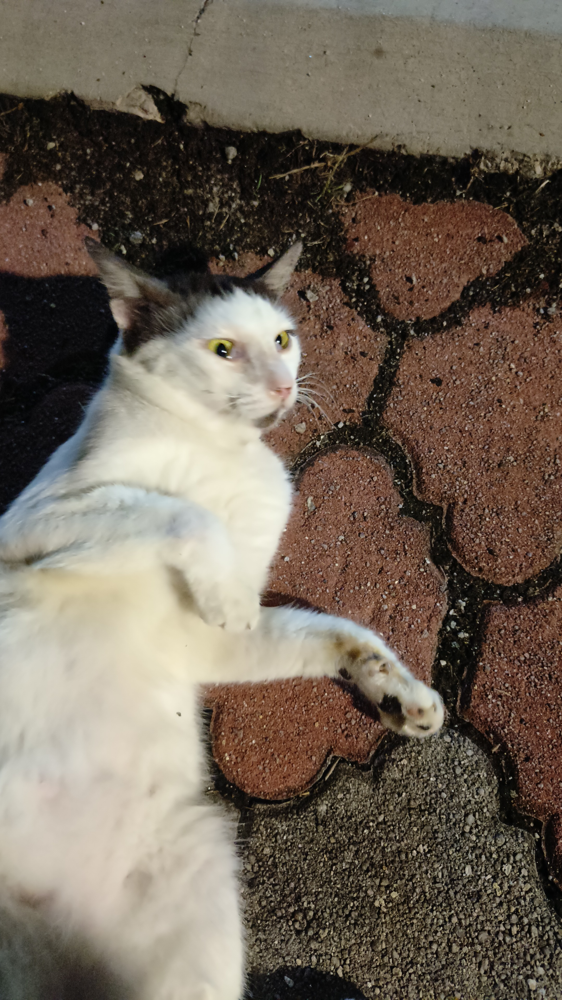
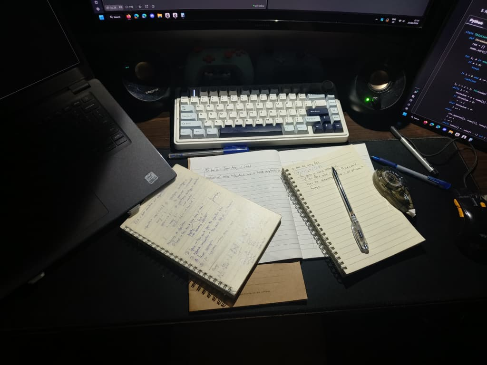

<!--  -->

> im unemployed, pls help

<span style="font-size:1.25rem">Welcome!</span>

This digital garden showcases my work, experiments, and ideas. I mainly focus on machine learning and deep learning.

> Connect with me! <a href="https://www.linkedin.com/in/jimmy-ding/" target="_blank" rel="noopener noreferrer"><svg xmlns="http://www.w3.org/2000/svg" width="24" height="24" viewBox="0 0 24 24" fill="none" stroke="currentColor" stroke-width="2" stroke-linecap="round" stroke-linejoin="round" class="lucide lucide-linkedin-icon lucide-linkedin"><path d="M16 8a6 6 0 0 1 6 6v7h-4v-7a2 2 0 0 0-2-2 2 2 0 0 0-2 2v7h-4v-7a6 6 0 0 1 6-6z"/><rect width="4" height="12" x="2" y="9"/><circle cx="4" cy="4" r="2"/></svg></a> <a href = "https://github.com/HappyPotatoHead" target="_blank" rel="noopener noreferrer"><svg xmlns="http://www.w3.org/2000/svg" width="24" height="24" viewBox="0 0 24 24" fill="none" stroke="currentColor" stroke-width="2" stroke-linecap="round" stroke-linejoin="round" class="lucide lucide-github-icon lucide-github"><path d="M15 22v-4a4.8 4.8 0 0 0-1-3.5c3 0 6-2 6-5.5.08-1.25-.27-2.48-1-3.5.28-1.15.28-2.35 0-3.5 0 0-1 0-3 1.5-2.64-.5-5.36-.5-8 0C6 2 5 2 5 2c-.3 1.15-.3 2.35 0 3.5A5.403 5.403 0 0 0 4 9c0 3.5 3 5.5 6 5.5-.39.49-.68 1.05-.85 1.65-.17.6-.22 1.23-.15 1.85v4"/><path d="M9 18c-4.51 2-5-2-7-2"/></svg></a> <a href = "https://www.instagram.com/_.jimmyd/" target="_blank" rel="noopener noreferrer"><svg width="24" height="24" viewBox="0 0 32 32" fill="currentColor" stroke="currentColor" stroke-width="2" stroke-linecap="round" stroke-linejoin="round" xmlns="http://www.w3.org/2000/svg"><g><path d="M22.3,8.4c-0.8,0-1.4,0.6-1.4,1.4c0,0.8,0.6,1.4,1.4,1.4c0.8,0,1.4-0.6,1.4-1.4C23.7,9,23.1,8.4,22.3,8.4z"/><path d="M16,10.2c-3.3,0-5.9,2.7-5.9,5.9s2.7,5.9,5.9,5.9s5.9-2.7,5.9-5.9S19.3,10.2,16,10.2z M16,19.9c-2.1,0-3.8-1.7-3.8-3.8   c0-2.1,1.7-3.8,3.8-3.8c2.1,0,3.8,1.7,3.8,3.8C19.8,18.2,18.1,19.9,16,19.9z"/><path d="M20.8,4h-9.5C7.2,4,4,7.2,4,11.2v9.5c0,4,3.2,7.2,7.2,7.2h9.5c4,0,7.2-3.2,7.2-7.2v-9.5C28,7.2,24.8,4,20.8,4z M25.7,20.8   c0,2.7-2.2,5-5,5h-9.5c-2.7,0-5-2.2-5-5v-9.5c0-2.7,2.2-5,5-5h9.5c2.7,0,5,2.2,5,5V20.8z"/></g></svg></a>

> If you want the projects -> [pinned](https://pinned.surge.sh)

> [!announcement]- Updates
> I am currently learning [rust](https://rust-lang.org)!
>
> Check out what I made while learning rust!
>
> [mediadl - a rust-based yt-dlp wrapper](https://github.com/HappyPotatoHead/mediadl)
>
> Added a bunch of things: [[Cross-Dataset Generalisation|here]] and [[Resources|here]] to name a few
>
> See the full changes at [[Logs]]

### Selected Work

> the big trees

- [[Offline Signature Verification]] - DL research, Deep metric learning, PyTorch ✨✨
- [[Cross-Dataset Generalisation]] - DL research, data augmentation, cross-dataset generalisation, PyTorch ✨✨
- [mediadl](https://github.com/HappyPotatoHead/mediadl) - Streamline YouTube audio archiving ✨✨
  - [audio-dl](https://github.com/HappyPotatoHead/audio-dl) is now a public archive
- [[Cardiovascular Risk Analysis]] - ML pipeline, feature engineering, evaluation

### Fun && Artistic Projects

> small, strange flowers and mushrooms

- [[Bongo Animals]] - Bongo with a shark and a dog
- [[something about letting go]] - there's something about letting go
- [[Jane Doe]] - to whom it may concern

### Side Quests

> small trails that we can follow

- [[Self-Hosting]] - Exploring Linux, Docker, home servers, data ownership
- [[How To - Set Up Arch Linux|How To: Set Up Arch Linux]]

### Notes and Resources

> seeds, clippings, and other things worth sharing

- [[Hobbies/What I read/index|Books, articles, curated notes]]
- [[Project Ideas|Project Ideas / Brainstorming]]
- [[Resources]]
- [nvim configuration](https://github.com/HappyPotatoHead/nvim-config)

> migrating to quartz5..

<!-- > [!QUOTE] Click me! -->
<!---->
<!-- > ```telescopic -->
<!-- > *<em>Try everything once</em> -->
<!-- > 	* <em>Forever and always, in every universe, wherever you are </em> -->
<!-- > 		* <em>Knowledge is not a reservoir to be hoarded but a river to be shared</em> -->
<!-- > 			* <em>He who has a Why to live for can bear almost any How</em><br><br>- Friedrich Nietzsche -->
<!-- > 				* <em>There are things which must cause you to lose your reason or you have none to lose</em><br><br> - Gotthold Lessing -->
<!-- > 					* <em>Set me like a seal upon thy heart, love is as strong as death </em> -->
<!-- > 						* <em>Do what you can, with what you have, where you are. </em><br><br> - Theodore Roosevelt -->
<!-- > 							* <em>Tiny steps, big results </em> -->
<!-- >                               * <em>As long as you continue to say the words <b>one day</b>, the dream is not over</em> -->
<!-- >                                   * <em>It's not alawys a bad thing to have a dream, with no plan for ever carrying it out</em> -->
<!-- > -->
<!-- > ``` -->

<!-- <Carousel> -->
<!--  -->
<!--  -->
<!--  -->
<!-- </Carousel> -->
